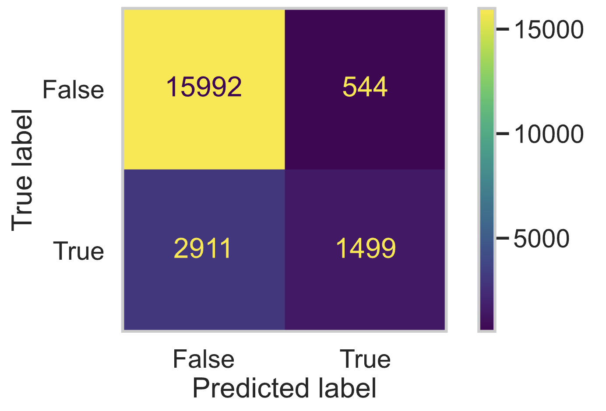

# The Rise and Fall of Keto in the Early 21st Century 
By: Allyson Ting (a2ting@ucsd.edu)

---
## Introduction 

The 21st Century has seen many fad diets pass in and out of the spotlight. In the 2010s, the Keto Diet and its idea of high-fat, moderate-protein, and low-carbs took that spotlight, even becoming the most Googled diet in the United States in 2020. Specifically, over 50% of calories should be from fat, over 10% from protein, and the remaining from carbohydrates. As this new definition of "health" invaded the media, the food people cooked may have changed to fit this standard, even if they were not specifically trying to eat keto. 

**How did the keto diet influence home-cooking?**
Besides percentages of fat and carbs, what characteristics best indicate whether a recipe is ketogenic or not?

Answering these questions is not only useful for bloggers looking to label their recipes as keto to gain traction, nor just for people trying to easily identify keto recipes to follow the diet, but investigating the relationship between the keto diet and home-cooking also offers insight into the influence of media on people's relationship with food. A more abstract question for this project: How does media end up in our mouths?

In this project, we analyze two datasets, `recipes` and `interactions`, from [food.com](https://www.food.com/). Our datasets contain information about recipes and recipe reviews spanning from 2008 until 2018 (more details below). This data was originally collected to experiment with a model that generates personalized recipes as explained in Majumder et al's research paper, [Generating Personalized Recipes from Historical User Preferences](https://cseweb.ucsd.edu/~jmcauley/pdfs/emnlp19c.pdf).

`recipes`, has 83782 rows, one for each recipe. 

| Column | Description |
| ----------- | ----------- |
| 'name' | recipe name |
| 'id' | recipe ID |
| 'minutes' | minutes to prepare recipe |
| 'contributor_id' | user id who submitted this recipe |
| 'submitted' | date recipe was submitted |
| 'tags' | Food.com tags for recipe |
| 'nutrition' | nutrition information ℹ️|
| 'n_steps' | number of steps in recipe |
| 'steps' | text for recipe steps, in order |
| 'description' | user-provided description |
| 'ingredients' | list of ingredient names |
| 'n_ingredients' | number of ingredients |

ℹ️ (calories (#), total fat (PDV), sugar (PDV) , sodium (PDV) , protein (PDV) , saturated fat (PDV) , and carbohydrates (PDV))

 `interactions` has 731927 rows, each corresponding to a rating left for a recipe. 
 
| Column | Description |
| ----------- | ----------- |
| 'user_id' | user ID |
| 'recipe_id' | recipe ID |
| 'date' | date of interaction |
| 'rating' | rating given |
| 'review' | review text |

The most relevant columns for our investigation are `'submitted'`, `'date'`, `'nutrition'`, `'tags'`, `'n_steps'`, and `'n_ingredients'`, all described above. 

## Data Cleaning and Exploratory Data Analysis

### Data Cleaning

To tailor the `recipes` and `interactions` datasets for our use, we conducted the following steps.

1. Merge the datasets 

- [x] Left merge `recipes` and `interactions` on 'id' and 'recipe_id' respectively.
- The resulting dataframe has 234429 rows which each correspond with a unique rating, recipe pair.

2. Check all data types to identify further cleaning.

| Column Name    | dtype   |
|:---------------|:--------|
| name           | object  |
| id             | int64   |
| minutes        | int64   |
| contributor_id | int64   |
| submitted      | object  |
| tags           | object  |
| nutrition      | object  |
| n_steps        | int64   |
| steps          | object  |
| description    | object  |
| ingredients    | object  |
| n_ingredients  | int64   |
| user_id        | float64 |
| recipe_id      | float64 |
| date           | object  |
| rating         | float64 |
| review         | object  |

- [x] Convert 'submitted' and 'date' to *datetime* data type and keep only the year.
- Our investigation is interested in keto's fluctuating influence over the time interval of our data so converting to *datetime* allows easy selection of the year to reduce noise, and renaming improves readability. 'date' is quite an ambiguous label.

- [x] Split the 'nutrition' column.
- 'nutrition' can be split into 7 columns of type *float*, `'calories (#)'`, `'total fat (PDV)'`, `'sugar (PDV)'`, `'sodium (PDV)'`, `'protein (PDV)'`, `'saturated fat (PDV)'`, and `'carbohydrates (PDV)'`, as per the column description for 'nutrition'. This allows numerical manipulation of individual nutrient columns and ultimately allows us to define our 'is_keto' column.

3. Fill all 0 values in 'rating' column with Nan.

- Ratings of 0 indicate that the reviewer did not leave a rating, so we fill 0 values with np.nan to avoid bias in our analysis.

4. Add an 'avg_rating' column.

- A recipe can be rated multiple times, so averaging the ratings gives each recipe a comprehensive rating which is useful for analyses that compare unique recipes.

5. Calculate proportion of calories for each nutrient

  - [x] Convert PDVs to grams
  - PDV stands for Percent Daily Value. Following, there are DVs or suggested Daily Values in grams for different nutrients. Multiplying the PDVs in each nutrient's column by the DVs given by the [FDA](https://www.fda.gov/food/nutrition-facts-label/daily-value-nutrition-and-supplement-facts-labels), we get the nutrition information for each recipe in **grams**. This is an intermediate step to our ultimate goal of calculating the proportion of calories for each nutrient.

  - [x] Convert grams to calories
  - With our nutrient columns now in grams, we construct a model to fit what calorie counts were used in our data. We used the coefficients of this model to assign how many calories are in each gram of fat, protein, and carbohydrate. These values get multiplied to the corresponding nutrients' columns to get **calories** of fat, protein, and carbohydrate in each recipe. 

  - [x] Calculate proportions
  - We divide the calories of fat, protein, and carbohydrate by the total calorie count from the original 'nutrition' column to get the separate proportions of a recipe's calories that are fat, protein, and carbohydrate. These proportions define a recipe as keto or not.

  - The final columns are named 'prop_fat', 'prop_protein', and 'prop_carb'.

6. Strip brackets and commas from 'tags' column

- Tags are often used in search engines because they can be very telling about recipes, in our case. Our idea is that the tags may be a characteristic that helps classify a recipe as keto or not. Stripping the brackets and commas gives rows of tags separated by spaces which allows us to easily test our idea further in this project. 

7. Add an `'is_dessert'` column

- `'is_dessert'` is a boolean column that checks if the tags of a recipe contains 'dessert' becasue desserts will contain more carbohydrates and therefore desserts may be less likely to be ketogenic.

8. Add an 'is_keto' column

- Congruent with the ketogenic requirements in the Introduction, 'is_keto' is True for recipes with 'prop_fat' >= 0.50 and 'prop_protein' >= 0.10 and False otherwise. These requirements ensure that 'prop_carb' is limited as per the high-fat, low-carb ideology of keto. The column will allow the analysis of the other columns in our dataset for keto vs. non-keto recipes. 

9. Select useful columns 

- At this point, the merged dataframe has a massive, 38 columns. To avoid dealing with such a large dataframe, we select the columns useful for the rest of this project.

| Column Name | dtype | Description |
|:--------------|:--------|:--------|
| recipe_id | float64 | recipe ID |
| name | object | recipe name |
| submitted | object | date recipe was submitted |
| date_rated | object | date recipe was reviewed |
| rating | float64 | rating given |
| avg_rating | float64 | recipe average rating |
| tags | object | Food.com tags for recipe |
| description | object | user-provided recipe description |
| is_dessert | bool | T if 'dessert' in tags, otherwise F |
| minutes | int64 | minutes to prepare recipe |
| n_steps | int64 | number of steps in a recipe |
| n_ingredients | int64 | number of ingredients in a recipe |
| nutrition | object | nutrition information |
| num_calories | float64 | total calories |
| prop_fat | float64 | proportion of calories from fat |
| prop_protein | float64 | porportion of calories from protein |
| prop_carb | float64 | proportion of calories from carbohydrates |
| is_keto | bool | T if recipe passes ketogenic requirements, else F |

- Our cleaned dataframe has 234429 rows and 18 columns, each row referring to a unique recipe, review pair. The first 5 rows are displayed below.

|    |   recipe_id | name                                 |   submitted |   date_rated |   rating |   avg_rating | tags                                                                                                                                                                             | description                                                                                                                                                                                                                                                                                                                                                                       | is_dessert   |   minutes |   n_steps |   n_ingredients | nutrition                                    |   num_calories |   prop_fat |   prop_protein |   prop_carb | is_keto   |
|---:|------------:|:-------------------------------------|------------:|-------------:|---------:|-------------:|:---------------------------------------------------------------------------------------------------------------------------------------------------------------------------------|:----------------------------------------------------------------------------------------------------------------------------------------------------------------------------------------------------------------------------------------------------------------------------------------------------------------------------------------------------------------------------------|:-------------|----------:|----------:|----------------:|:---------------------------------------------|---------------:|-----------:|---------------:|------------:|:----------|
|  0 |      333281 | 1 brownies in the world    best ever |        2008 |         2008 |        4 |            4 | 60-minutes-or-less time-to-make course main-ingredient preparation for-large-groups desserts lunch snacks cookies-and-brownies chocolate bar-cookies brownies number-of-servings | these are the most; chocolatey, moist, rich, dense, fudgy, delicious brownies that you'll ever make.....sereiously! there's no doubt that these will be your fav brownies ever for you can add things to them or make them plain.....either way they're pure heaven!                                                                                                              | True         |        40 |        10 |               9 | [138.4, 10.0, 50.0, 3.0, 3.0, 19.0, 6.0]     |          138.4 |   0.427344 |      0.0499551 |    0.522701 | False     |
|  1 |      453467 | 1 in canada chocolate chip cookies   |        2011 |         2012 |        5 |            5 | 60-minutes-or-less time-to-make cuisine preparation north-american for-large-groups canadian british-columbian number-of-servings                                                | this is the recipe that we use at my school cafeteria for chocolate chip cookies. they must be the best chocolate chip cookies i have ever had! if you don't have margarine or don't like it, then just use butter (softened) instead.                                                                                                                                            | False        |        45 |        12 |              11 | [595.1, 46.0, 211.0, 22.0, 13.0, 51.0, 26.0] |          595.1 |   0.442018 |      0.048675  |    0.509307 | False     |
|  2 |      306168 | 412 broccoli casserole               |        2008 |         2008 |        5 |            5 | 60-minutes-or-less time-to-make course main-ingredient preparation side-dishes vegetables easy beginner-cook broccoli                                                            | since there are already 411 recipes for broccoli casserole posted to "zaar" ,i decided to call this one  #412 broccoli casserole.i don't think there are any like this one in the database. i based this one on the famous "green bean casserole" from campbell's soup. but i think mine is better since i don't like cream of mushroom soup.submitted to "zaar" on may 28th,2008 | False        |        40 |         6 |               9 | [194.8, 20.0, 6.0, 32.0, 22.0, 36.0, 3.0]    |          194.8 |   0.576567 |      0.247128  |    0.176305 | True      |
|  3 |      306168 | 412 broccoli casserole               |        2008 |         2009 |        5 |            5 | 60-minutes-or-less time-to-make course main-ingredient preparation side-dishes vegetables easy beginner-cook broccoli                                                            | since there are already 411 recipes for broccoli casserole posted to "zaar" ,i decided to call this one  #412 broccoli casserole.i don't think there are any like this one in the database. i based this one on the famous "green bean casserole" from campbell's soup. but i think mine is better since i don't like cream of mushroom soup.submitted to "zaar" on may 28th,2008 | False        |        40 |         6 |               9 | [194.8, 20.0, 6.0, 32.0, 22.0, 36.0, 3.0]    |          194.8 |   0.576567 |      0.247128  |    0.176305 | True      |
|  4 |      306168 | 412 broccoli casserole               |        2008 |         2013 |        5 |            5 | 60-minutes-or-less time-to-make course main-ingredient preparation side-dishes vegetables easy beginner-cook broccoli                                                            | since there are already 411 recipes for broccoli casserole posted to "zaar" ,i decided to call this one  #412 broccoli casserole.i don't think there are any like this one in the database. i based this one on the famous "green bean casserole" from campbell's soup. but i think mine is better since i don't like cream of mushroom soup.submitted to "zaar" on may 28th,2008 | False        |        40 |         6 |               9 | [194.8, 20.0, 6.0, 32.0, 22.0, 36.0, 3.0]    |          194.8 |   0.576567 |      0.247128  |    0.176305 | True      |

### Univariate Analysis

<iframe
  src="plots/num-cals.html"
  width="800"
  height="600"
  frameborder="0"
></iframe>

We see a heavily right skewed distribution of calorie counts. There is a wide range of calorie counts in our dataset, specifically 0 to 45609.  The above graph is limited to calorie counts between 0 and 2000 because of the high outliers. Becuase not many recipes can possibly have 0 calories, this might indicate some incorrect values in the 'nutrition' column and the following 'num_calories' column. The long tail of this distribution also emphasizes that the recipes in our dataset are not standardized by serving size, so calculating proportions of nutrients allows us to more easily compare recipes with a more even scale. 

### Bivariate Analysis

<iframe
  src="plots/k-nonk-rating.html"
  width="800"
  height="600"
  frameborder="0"
></iframe>

(Recall that in our cleaned dataframe, our avg_rating column has many repeated values, specifically the same value for each unique.) 

Before plotting, I grouped by 'recipe_id', so that the number of times a recipe was made and rated wouldn't affect our display. The display shows that the average ratings for keto and non-keto recipes are basically identical. The non-keto distribution seems to have more outliers, but this could be explained by our dataset having more non-keto recipes in general. This shows that rating is probably not a characteristic that could help indentify a recipe as keto vs. non-keto.

### Interesting Aggregates

|   date_rated |    False |     True |
|-------------:|---------:|---------:|
|         2008 | 0.795113 | 0.204887 |
|         2009 | 0.78798  | 0.21202  |
|         2010 | 0.791966 | 0.208034 |
|         2011 | 0.795662 | 0.204338 |
|         2012 | 0.748059 | 0.251941 |
|         2013 | 0.751384 | 0.248616 |
|         2014 | 0.745072 | 0.254928 |
|         2015 | 0.775896 | 0.224104 |
|         2016 | 0.772114 | 0.227886 |
|         2017 | 0.763039 | 0.236961 |
|         2018 | 0.77983  | 0.22017  |

This table gives the proportions of recipes that were keto or non-keto given the year of rating. Just skimming the table, around 77% of recipes made in each year were not keto and therefore about 23% were keto. As these splits are pretty even, it looks like there is no relationship between the year and the popularity of keto recipes, but we will explore this conclusion in a more rigourous way. 

## Assessment of Missingness

### NMAR Analysis

There are many missing values in our cleaned dataframe, specifically:

| Column Name | Number of Missing Values|
|:--------------|------:|
| rating        | 15036 |
| avg_rating    |  2777 |
| prop_carb     |  2615 |
| prop_protein  |  2615 |
| prop_fat      |  2615 |
| description   |   114 |
| recipe_id     |     1 |
| date_rated    |     1 |
| name          |     1 |
| nutrition     |     0 |
| num_calories  |     0 |
| minutes       |     0 |
| n_ingredients |     0 |
| n_steps       |     0 |
| is_dessert    |     0 |
| tags          |     0 |
| submitted     |     0 |
| is_keto       |     0 |

The 'rating' column has many missing values, and I believe this to be NMAR because whether or not a person leaves a rating on a recipe depends on how strongly they felt towards the recipe. If a person had no strong feeling towards the recipe, they would be less inclined to go through the effort of rating a recipe. It might be more difficult to even think of rating. On the other hand, if they really liked a recipe, thinking of a score between 1 and 5 would be easy. Therefore, the missingness of the 'rating' column depends on the actual value that is missing. 

If another question like, "Was thinking of a rating difficult? Yes or No." was asked, the missingness of 'rating' would likely be MAR, with missingness in 'rating' more likely for values of Yes in the added column. On the other hand, if the rating survey required users to submit a score between 1 and 5, not giving the option to leave this question blank, this would avoid missingness, and we might expect more mediocre to low scores. Our current dataset is dominated by high ratings.

|   rating |   count |
|---------:|--------:|
|        5 |  169676 |
|        4 |   37307 |
|        3 |    7172 |
|        1 |    2870 |
|        2 |    2368 |

### Missingness Dependency

Moving on to investigate the missingness of the 'description' column, we hypothesize that the missingness of the 'description' column could have something to do with how complicated a recipe is, the logic being: Recipe-writers might want to leave a description for more complex recipes, those with more ingredients, and or recipes that make a larger quantity of food, those with higher calorie counts. The higher calorie count could also be associated with the complexity of a recipe. Following this logic, I will investigate whether the missingness in the 'description' column depends on'num_calories', the number of calories in a recipe, or 'n_ingredients', the number of ingredients used in a recipe. 

> 'description' v. 'num_calories'

**NULL Hypothesis**: The missingness of 'description' is independent of 'num_calories', the number of calories made by a recipe.
**ALTERNATIVE Hypothesis**: The missingness of 'description' is related to the number of calories in a recipe. 

**Test Statistic**: The absolute difference between the mean number of calories of the groups of recipes with and without missing descriptions.

**α** = 0.05

<iframe
  src="plots/cals-missi-descr.html"
  width="800"
  height="600"
  frameborder="0"
></iframe>

It seems that the distributions of calories for recipes with (orange) and without descriptions (blue) is about the same. To better understand this relationship, we ran a permutation test by shuffling the 'num_calories' column, finding the mean number of calories of recipes with and without descriptions, and calculating the absolute difference in means. 

<iframe
  src="plots/cals-diff-missi-descr.html"
  width="800"
  height="600"
  frameborder="0"
></iframe>

**P-Value: 0.23**

Because the p-value for our experiment is greater than our significance level of 0.05, we **fail to reject the null hypothesis** and conclude that the missingness in the 'description' column is not related to the number calories of a recipe. 

> 'description' v. 'n_ingredients'

**NULL Hypothesis**: The missingness of 'description' is independent of 'n_ingredients', the number of ingredients used in a recipe. 
**ALTERNATIVE Hypothesis**: The missingness of 'description' is related to the number of ingredients used in a recipe.

**Test Statistic**: The absolute difference between the mean number of ingredients of the groups of recipes with and without missing descriptions.

**α** = 0.05

<iframe
  src="plots/ingr-missi-descr.html"
  width="800"
  height="600"
  frameborder="0"
></iframe>

The distributions of the number of ingredients for recipes with (orange) and without descriptions (blue) appear to have the same general shape, but the distribution of recipes with descriptions has much more variation and is perhaps shifted slightly right of the missing descriptions distribution. There are many more recipes with descriptions than without, so this could lead to the variation we observe. To investigate, we ran another permutation test, but this time with 'num_ingredients'.

<iframe
  src="plots/ingr-diff-missi-descr.html"
  width="800"
  height="600"
  frameborder="0"
></iframe>

**P-Value: 0.002**

The p-value for our experiment is well below the significance level of 0.05, so we **reject the null hypothesis** and conclude that the missingness of 'description' does depend on the 'num_ingredients' used in a recipe. In other words, the 'description' column is MAR when conditioned on the number of ingredients used in a recipe.

Our findings suggest that the number of ingredients used might be a better indicator of the complexity of a recipe than total calories.

## Hypothesis Testing

Recall our overall question:
> How did the keto diet influence home-cooking?

To answer part of this question, we are interested in the popularity of the keto diet over time, specifically 2008-2018 for our dataset. 
> Did people start cooking more keto recipes as the diet approached its peak popularity in 2020?
We split our dataset into two groups, recipes rated in the years 2008-2012 and those rated from 2013-2018. Note that these time intervals contain all entries in our dataset and we assume that users rated recipes that they actually cooked, so recipes *made* is the same as recipes *rated*.

<iframe
  src="plots/k-nonk-per-yr.html"
  width="800"
  height="600"
  frameborder="0"
></iframe>

Most recipes, keto or non-keto, were made in the first half of our time interval, so we will continue our investigation using proportions of recipes in their respective time intervals. i.e. #keto recipes 2008-2012 ÷ #recipes 2008-2012

**NULL Hypothesis**: The proportion of keto recipes made in the second half of our interval (2013-2018) is the same as the proportion of Keto recipes made in the first half of our time interval (2008-2012).
**ALTERNATIVE Hypothesis**: A higher proportion of keto recipes were made from 2013 to 2018. As we approached 2020, the influence of the keto diet grew. 

**Test Statistic**: Difference in Proportion of Keto compliant recipes ([2013, 2018] - [2008,2012]).

**α** = 0.05

<iframe
  src="plots/keto-time.html"
  width="800"
  height="600"
  frameborder="0"
></iframe>

With a p-value of 0.00, we reject the null hypothesis and conclude that significantly more Keto recipes were made in 2013-2018 as compared to 2008-2012, in terms of proportions. Of all recipes made within 20013-2018, the proportion of them that are Keto is significantly higher than the proportion of Keto recipes out of all recipes made within 2008-2012. This suggests that Keto seems to have had more influence in the years 2013-2018, but this is only the findings from one dataset and more research would have to be done to made a broader statement about the influence of the Keto diet on people's cooking habits over time.

## Framing a Prediction Problem

### Type of Prediction: Binary Classification 

We want to **classify a recipe as keto or non-keto** using easily accessible characteristics of a recipe. Becasue proportions of fat, protein, and carbs are not often easily accessible to the common user, labeling a recipe as keto according to proportion requirements, as we did in our data cleaning step, is difficult. We want to investigate what characteristics of recipes can help users form an educated prediction of whether a recipe is keto or not. 

### Response Variable: True or False for 'is_keto'

This response variable is useful for recipe-makers and recipe-followers looking to quickly decide if a recipe is keto or not. We also previously found a significant relationship between the date a recipe was made and whether or not it was keto, so given all the data in our dataset, I believe we can make a good prediciton that also offers some insight into what are markers of a keto recipe (📂).

Identifying these markers helps answer our overall question, "How did the keto diet influence home-cooking?". For example, if we find that keto recipes have fewer ingredients in general, this could suggest an overall trend towards using fewer ingredients in home-cooking.

### Metric: F1-Score

We will use the f1-score instead of accuracy to evaluate our model becuase there are large class imblances within 'is_keto' (more non-keto) as well as in 'date_rated' and 'submitted' (right skews). Accuracy can be a misleading metric becuase a model can achieve high accuracy by simply predicting the majority class, even if it completely fails to identify the minority class. The f1-score provides a balanced view of performance, emphasizing the minority class as well as false negative and false positive results.

(📂) All of the information we are using in our prediction model is information that a random user would be able to find on any recipe blog for a recipe they are trying to follow. The date a recipe was posted, when it was reviewed by other users, the number of ingredients, etc. would all be accessible at the "time of prediction". In fact, all of the columns in our merged dataframe (besides the 'is_keto' column) are fair game for our model.

## Baseline Model

Drawing on the relationship we found between proportions of keto recipes and time, we constructed a random forest classifier with 2 features, 'submitted' and 'date_rated' for our baseline model. Both columns are ordinal, only containing years from 2008 to 2018 corresponding to the dates recipes were submitted and rated. 

We binarized both columns with a threshold of 2013 to split our data into 2 time intervals (similar to our procedure in our hypothesis test). 

Although our model performed consistently with our training and test sets, the f1-score of 0.682 is slightly worse than a model that predicts all non-keto, which has an f1-score of 0.683. This shows that our baseline model is definately not good because we are better off simply predicting non-keto for all recipes.

## Final Model

Our final model has 5 features: 'submitted', 'tags', 'minutes', 'n_steps', and 'n_ingredients'.

> 'submitted'

We previously found that there is a relationship between 'date_rated' and 'is_keto' and our baseline model tried to capitalize on this. Upon further investigation, we found that 'date_rated' and 'submitted' are highly correlated--most recipes were rated in the same year that they were submitted. Training on both of these columns did not improve our model, perhaps even reducing predictive accuracy. To solve this issue of multicollinearity, we chose to omit 'date_rated' because 'submitted', the year a recipe was submitted, is unique to each recipe and more easily accesible to potential users of our model. We binarized 'submitted' with a threshold of 2013.

> 'tags'

The 'tags' column contains labels that offer information about its corresponding recipe, some popular tags being *preparation*, *dietary*, and *easy*. Tags are often used to classify recipes and improve searchability on sites like [food.com](https://www.food.com/). In our data cleaning step, we created the 'is_dessert' column from whether or not *dessert* was tagged. We found that 20% of non-keto recipes are desserts while only 2% of keto recipes are desserts. This suggests that the *dessert* tag as well as other tags could help with our prediction model. Instead of searching for *keto* specifically, users could search for tags that are common or not common for keto recipes. We count-vectorized 'tags' and added this feature to our model.

> 'minutes'

In our dataset, the average number of minutes for non-keto recipes is 123.58 minutes and 82.57 minutes for keto recipes. This difference in means suggests that 'minutes' could help our predictions. Also, the minutes to prepare a recipe is often very accesible, usually available in the description of any recipe. We transformed 'minutes' with RobustScaler because the 'minutes' column has many high outliers that we do not want biasing our predictions.

> 'n_steps' & 'n_ingredients'

Because the keto diet is defined along strict nutrient requirements, it is reasonable to assume that keto recipes would err on the side of simplicity--fewer steps and fewer ingredients. Applying findings from our missingness analysis, we know that 'n_ingredients' is a good indicator of the complexity of a recipe. Also, an emphasis on simplistic and efficient recipes aligns with the keto diet being a fad diet in the 2010s. As with the rest of our chosen features, the number of steps and ingredients in a recipe are very easily accessed characteristics of a recipe, maintaining the practicality and usability of our prediction model. Observing that the distributions of 'n_steps' and 'n_ingredients' were both right skewed, we transformed both features to follow a normal distribution with QuantileTransformer.

---
We used all 5 of these features in a RandomForestClassifier as our prediction model. To select our max_depth hyperparameter, we used GridSearchCV to determine the best max_depth of 32 for our classifier. Decision tree classifiers are prone to overfitting and high variance, so fitting a max_depth prevents these negative traits of our modeling algorithm. 
---

Our final model is a RandomFroestClassifer with a max_depth of 32 and 100 n_estimators. The f1-score on the training set is 0.928, 0.813 for the test set, and 0.911 on our entire dataset. This is a 0.229 increase from our baseline model and a 0.228 increase from the model that predicts all non-keto. Our final model is drastically more accurate than our baseline model.

Our final model's performance on test data:

False = not keto, True = keto

Beyond the general accuracy of our model, we are satisfied with our model's performance because the most detrimental error would be a false positive result, and false positives are minimized. It is acceptable if a keto recipe is misclassified as not keto because people not following the keto diet would not mind if a recipe happened to be keto. However, a person who is following the keto diet *would* mind if a non-ketogenic recipe was classified as being keto. If recipe-writers used this model to classify their recipe as keto, a false positive result would lead to false marketing, which is illegal to some capacity.

## Fairness Analysis

To ensure that our model does not perform differently for different groups of individuals - recipes in our case, we performed a fairness analysis to answer this question:

Does my model perform worse for recipes that did not receive the highest rating (below or equal to 4.99) than it does for recipes that did earn the highest rating (equal to 5.00)?

- Group X: recipes with ratings below 5.00
- Group Y: recipes with full ratings of 5.00
- Evaluation metric: precision parity 🎯

🎯 As stated above, false positives are more detrimental in our model's context, so we will measure the precision parity of our classifer.

---

**NULL Hypothesis**: Our model for predicting whether a recipe is keto or non-keto compliant, is fair. Its precision metrics for recipes with and without a full rating are roughly the same, and any differences are due to random chance.

**ALTERNATIVE Hypothesis**: Our model is not fair. Its precision for recipes with a full rating is higher than its precision for recipes with anything below a full, 5.0 rating.

**Test Statistic**: Difference in precision (full rating - not full)

**α** = 0.05

---

<iframe
  src="plots/prec-diff-5-non5.html"
  width="800"
  height="600"
  frameborder="0"
></iframe>

To perform this permutation test, we created a new boolean column 'full_rating' with True values being full ratings of 5.00 and False being any rating besides 5.00. We shuffled 'full_rating' 1000 times and calculated the difference in precision according to the test statistic description above. 

We get a p-value of 0.21 which is well above our significance level of 0.05, so we fail to reject the null hypothesis and conclude that there is insufficient evidence to suggest that our model is unfair. Our model is most likely fiar, having approximately equal precision when predicting whether a recipe is keto or non-keto, regardless of the rating of the recipe.

## Final Thoughts

Looking at the trends of characteristics that help define whether a recipe is keto, we can think about whether keto caused these trends in the first place and whether keto has had a positive or negative influence on home-cooking. Following a recipe at home should be focused on comfort and community, but with the influence of fad diets like keto, do people now prioritize the wrong things when choosing recipes and cooking at home?
